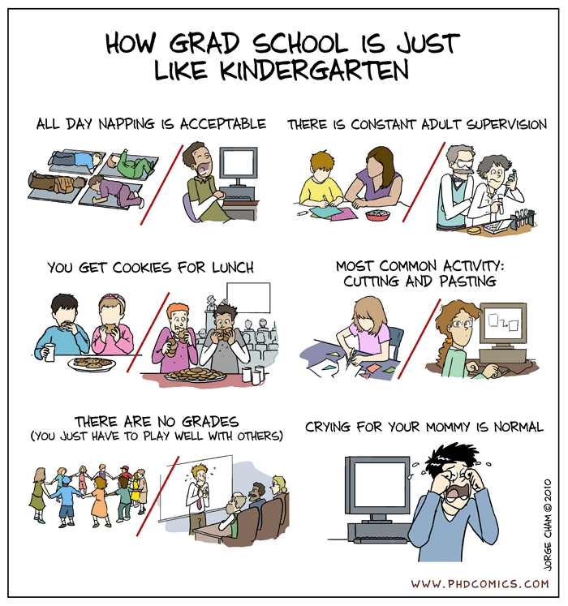

It's common to hear that the Ph.D. is "hard". However, contrary to what one could expect, it is not because of the abstract processing power required to follow it, nor because of the volume of data you need to digest. In my experience, the hard bit in the Ph.D. &mdash; the part that feeds our anxiety and makes us all feel like impostors &mdash; comes from how different it is from everything else we've done so far in our student life.

<!--more-->

Up to this point, the school system expects us to familiarize ourselves with the common tools and with the canonical results in a given field. Put otherwise, the typical undergraduate course presents a classic set of questions and their accepted answers: our job is to be able to incorporate and replicate them. That's exactly why there are "right" and "wrong" answers in the exams.

By definition, most of the time during the Ph.D. is invested in pursuing questions that have no widely accepted answer yet, or developing tools that were never used before. There is no "solution set" at the end of the book to which you can compare your results when you're done (or if you're tempted to give up). At the end of the day, who decides if your question is interesting and if your answer is valid are your peers, i.e. the other people in the field who have worked on those questions themselves. We are navigating uncharted territory: that's what makes it so exciting &mdash; and often also very frustrating.

How to start? Where can one find new ideas? How to best allocate the time? How to write a nice paper? Those can be paralyzing fears. The good news is that a lot of people have done it before and they have been kind enough to share their wisdom. Some of the best advice I encountered so far came from people on the internet who I've never met, so I decided that the best way to thank them (and to help others in the same situation I am) is just to spread their good word.

Hence, here's a short collection of helpful resources from smart people on how to survive your graduate studies. Most of it is aimed at economists, but there should be useful bits to students in other fields as well. Take the time to go over their full documents, it does pay off!

 

- [**Ph.D. Thesis Research: Where do I Start?**, by Don Davis](http://www.columbia.edu/~drd28/Thesis%20Research.pdf)

<blockquote class="blockquote"> First, there is no "Right Topic." What is hot today may be ice cold by the time that you go on the job market. You don’t want the nineteenth best paper of the year on a hot topic. Much more important is to find something that is important and genuinely interests you. There are great papers to be written in almost all fields. You need to settle on an area where you are sufficiently interested that you don’t mind making some investments, since these investments are preparing you not only for thesis work but also for your next round of papers as an assistant professor. </blockquote>

 

- [**How to get started on research in economics?**, by Steve Pischke](http://econ.lse.ac.uk/staff/spischke/phds/get_started.pdf)

<blockquote class="blockquote"> What makes a good project, research question? It should be interesting – original – feasible. Tradeoff: the more novel is what you are doing, the lower the standards for execution you will get away with.</blockquote>

 

- [**A Few Tips for Being a More Successful Graduate Student**, by Darren Lubotsky](https://lubotsky.weebly.com/uploads/2/3/1/7/23178366/a_few_tips_for_being_a_more_successful_graduate_student_darren_lubotsky.pdf)

<blockquote class="blockquote"> It is difficult to make a contribution to a field while you learn the literature and econometric tools at the same time. For your own sanity, keep your research goals reasonable and start small. Don't pressure yourself to come up with a great paper right away. You don’t need a home run paper to get a good job. But you do need a solid single. </blockquote>

 

- [**Let’s talk …**, by Claudia Sahm](http://macromomblog.com/2019/09/01/lets-talk/)

<blockquote class="blockquote"> Communication in writing, visualizing, and speaking deserves as much effort as your analysis. The 'there' there, such as, getting your model to converge and using the best identification possible is necessary but not sufficient for a kick-ass paper.</blockquote>

 

- But don't worry too much. In the end, [**grad school is just like kindergarten**, by PhD comics](http://phdcomics.com/comics/archive.php?comicid=1286).

 

Is it helpful? Do you disagree with those points? Did I miss something great? Let me know!

*Updated on 16-08-2020*
