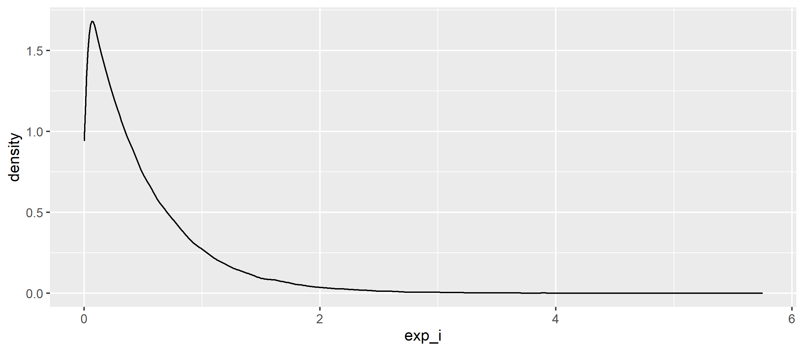
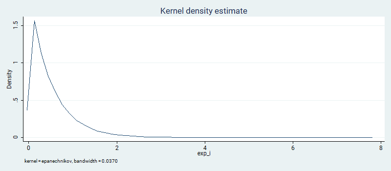
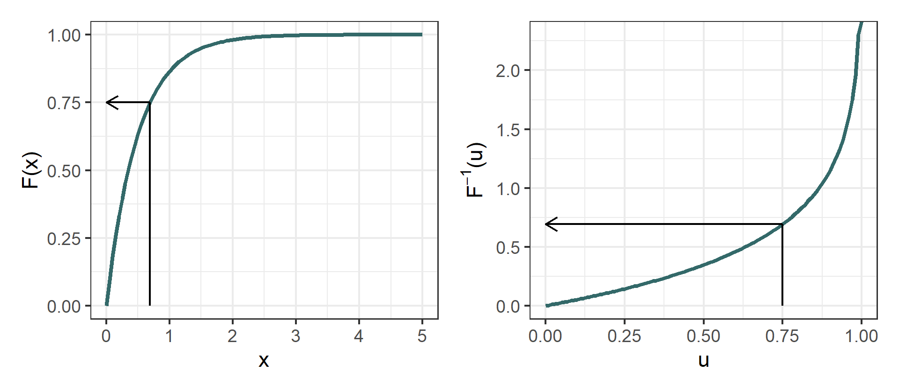

Simulating data is often an easy way to check whether an estimation is working as intended before applying it to real data. The key advantages are that (a) you know exactly how each variable was generated and (b) your sample is as large as you need it to be. But how do you actually get random draws from a given distribution?

<!--more-->

**The pragmatic answer is:** for the usual distributions, most statistical softwares will have a function that does that for you. For a quick reference, check this table.

<table class="table table-sm">
  <thead class="thead-light">
  <tr>
    <th scope="col">Distribution</th>
    <th scope="col">R function</th>
    <th scope="col">Stata function</th>
  </tr>
  </thead>
  <tbody>
  <tr>
    <td scope="row">Uniform</td>
    <td><samp><samp>runif(n, min = 0, max = 1)</samp></samp></td>
    <td><samp>runiform(a, b)</samp></td>
  </tr>
  <tr>
    <td scope="row">Normal</td>
    <td><samp>rnorm(n, mean = 0, sd = 1)</samp></td>
    <td><samp>rnormal()</samp></td>
  </tr>
  <tr>
    <td scope="row">Binomial</td>
    <td><samp>rbinom(n, size, prob)</samp></td>
    <td><samp>rbinomial(n, p)</samp></td>
  </tr>
  <tr>
    <td scope="row">Exponential</td>
    <td><samp>rexp(n, rate = 1)</samp></td>
    <td><samp>rexponential(b)</samp></td>
  </tr>
  <tr>
    <td scope="row">Weibull</td>
    <td><samp>rweibull(n, shape, scale = 1)</samp></td>
    <td><samp>rweibullph(a, b)</samp></td>
  </tr>
  <tr>
    <td scope="row">Gamma</td>
    <td><samp>rgamma(n, shape, rate = 1, scale = 1/rate)</samp></td>
    <td><samp>rgamma(a, b)</samp></td>
  </tr>
</tbody>
</table>

<br>

**The general answer is:** if you need more flexibility, you can simulate random draws for any arbitrary distribution you can think of, provided that you can write down an analytical form for the inverse of its cumulative distribution function $F(\cdot)$. You just need to take this new function $F^{-1}(\cdot)$ and evaluate it using draws from the standard uniform. This works because $x_i = F^{-1}(u_i)$ will be distributed according to the density $f(\cdot)$ for $U \sim \text{Uniform} \, \mathrm{(0, 1)}$.

<br>

##### Example: Draws from an exponential distribution

Suppose you need to simulate draws from an [exponential distribution](https://en.wikipedia.org/wiki/Exponential_distribution). This distribution is a nice one because it's fully characterized by a single parameter $\lambda$ (often called the rate parameter) and it's useful in a number of applications, particularly those related with the [modeling of duration](https://en.wikipedia.org/wiki/Survival_analysis). We know that for non-negative values of $x$ its CDF is given by:

$$ F(x; \lambda) = 1 - \exp(-\lambda x)$$

And the inverse of it could be written as:

$$F^{-1}(x; \lambda) = - \frac{\log(1-x)}{\lambda}$$

All you need to do is generate random draws $u_i$ from the standard [0, 1] uniform and input them in the above function to get $x_i = F^{-1}(u_i; \lambda)$, which will follow an exponential distribution of rate $\lambda$.

<br>

##### Code example using R

``` r
# How many draws?
N <- 100000

# A vector of n draws from an uniform distribution
u_i <- runif(n = N, min = 0, max = 1)

# Parameter that defines the distribution of interest
lambda <- 2

# Draws from an exponential distribution using the inverse of its CDF
exp_i <- -log(1 - u_i) / lambda

# A density plot with the simulated values
library(ggplot2)
ggplot(as.data.frame(exp_i)) + geom_density(aes(x = exp_i))
```

<div class = "text-center">

</div>

<br>

If you check the mean and the standard deviation of <kbd>exp_i</kbd>, you should find values close to 0.5 (or, in general, $1/\lambda$). Note too that the distribution created this way converges to what you would obtain using R's function <kbd>rexp(n = 100000, rate = 2)</kbd>. After all, what the software is doing under the hood is not much different from what we are doing explicitly.

<br>

##### Code example using Stata

```
* How many draws?
set obs 100000

* Draws from an uniform distribution
gen u_i = runiform()

* Parameter that defines the distribution of interest
scalar lambda = 2

* Draws from an exponential distribution using the inverse of its CDF
gen exp_i = -log(1 - u_i) / lambda

* A density plot with the simulated values
kdensity exp_i
```

<div class = "text-center">

</div>
<br>

Again, the results are similar to what one would obtain with Stata's own <kbd>rexponential(2)</kbd>.

More importantly, however, is that the same strategy goes beyond the simple exponential case and can be easily generalized for more exotic distributions that do not have a preexisting random function available or for cases in which the default parametrization is different from the one you would need.

<br>

##### Why does it work?

The CDF, by definition, maps every possible value a function can take into the interval between 0 and 1. Intuitively, the strategy above makes use of this property and revert the mapping, from the interval [0, 1] back to the support of the function. The shape of $F^{-1}(\cdot)$ alone is enough to make more frequent values of $x_i$ appear more often, even if every $u_i$ has the same probability of being used in the process. Cool, no?

<div class = "text-center">

</div>

<br>
<hr>

Is it helpful? Is there a mistake somewhere? Did I miss something important? Let me know :)

*Updated on 25-10-2020*
