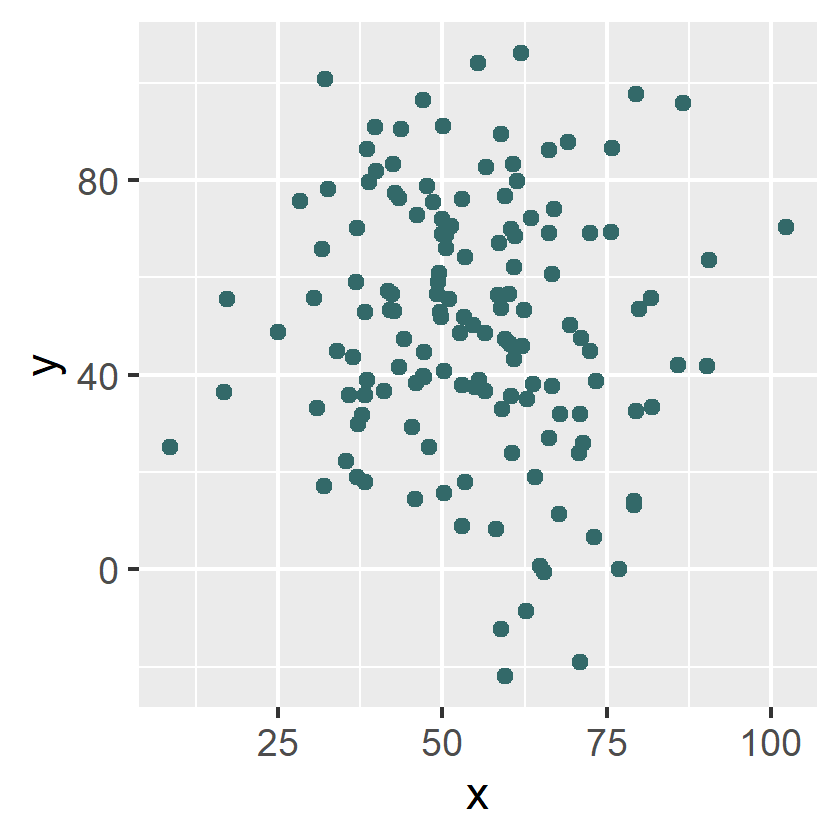
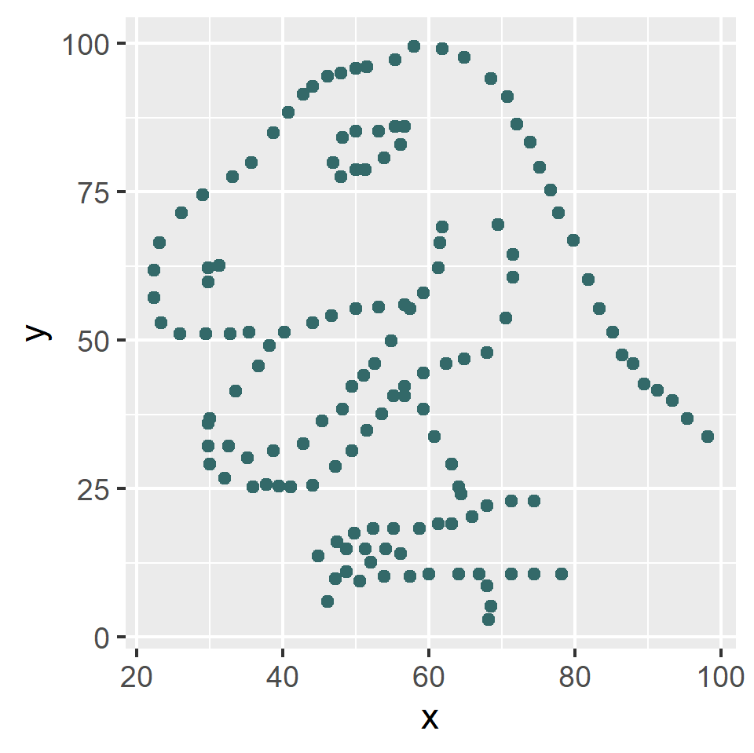
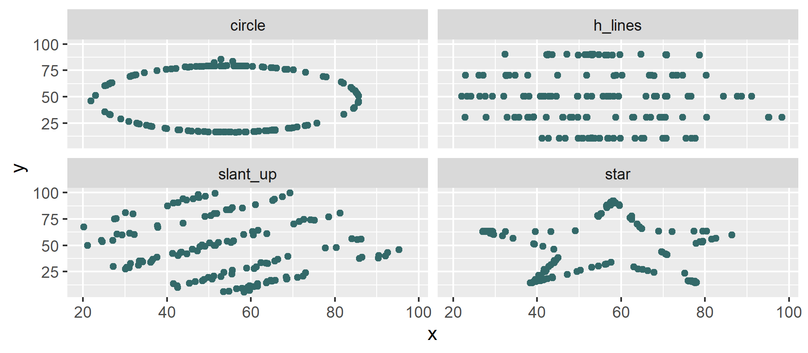

Summary statistics are great tools: they reduce a potentially large number of observations down to a single number that is easy to interpret and communicate. This feature justifies the widespread popularity of averages and correlations, from introductory statistics courses and newspaper articles to scientific papers. The caveat is that they are usually insufficient to tell the whole history, as it is nicely illustrated by a group of datasets known as the "datasaurus dozen".

<!--more-->
<br>

##### Overview of the datasets

The original datasaurus was designed by Alberto Cairo as a toy example to emphasize the importance of plotting the data (see [thefunctionalart.com](http://www.thefunctionalart.com/2016/08/download-datasaurus-never-trust-summary.html)). The dataset has only two variables (x and y), and their summary statistics are not particularly interesting.

``` r
# Summary stats
library(dplyr)
library(datasauRus)

summary_stats <- datasaurus_dozen %>%
  filter(dataset == "dino") %>%
  summarise(
    n = n(),
    mean_x = mean(x),
    sd_x = sd(x),
    mean_y = mean(y),
    sd_y = sd(y),
    cor_xy = cor(x, y),
    beta_coef = cov(x, y) / var(x)
  )

summary_stats %>% knitr::kable(format = "rst", digits = 2)
```

<table class="table table-sm">
  <thead class="thead-light">
  <tr>
   <th style="text-align:center;"> n </th>
   <th style="text-align:center;"> mean_x </th>
   <th style="text-align:center;"> sd_x </th>
   <th style="text-align:center;"> mean_y </th>
   <th style="text-align:center;"> sd_y </th>
   <th style="text-align:center;"> cor_xy </th>
   <th style="text-align:center;"> beta_coef </th>
  </tr>
 </thead>
<tbody>
  <tr>
   <td style="text-align:center;"> 142 </td>
   <td style="text-align:center;"> 54.26 </td>
   <td style="text-align:center;"> 16.77 </td>
   <td style="text-align:center;"> 47.83 </td>
   <td style="text-align:center;"> 26.94 </td>
   <td style="text-align:center;"> -0.06 </td>
   <td style="text-align:center;"> -0.1 </td>
  </tr>
</tbody>
</table>

In fact, if you were to imagine that those 142 observations come from a bivariate normal distribution, their summary statistics could well suggest something like this:

``` r
# Generate random data under the known summary stats
library(mvtnorm)
attach(summary_stats)

random_data <- mvtnorm::rmvnorm(
  n = 142,
  mean = c(mean_x, mean_y),
  sigma = matrix(c(sd_x^2, sd_x * sd_y * cor_xy, sd_x * sd_y * cor_xy, sd_y^2), 2))

colnames(random_data) <- c("x", "y")

# Potential scatter plot under known summary stats
library(ggplot2)

random_data %>%
  as.data.frame() %>%
  ggplot(aes(x = x, y = y)) +
  geom_point(color = "#336969")
```

<div class = "text-center">

</div>

And yet this is the unexpected scatter plot of the datasaurus:

``` r
# Scatter plot of Cairo's datasaurus
datasaurus_dozen %>%
  filter(dataset == "dino") %>%
  ggplot(aes(x = x, y = y)) +
  geom_point(color = "#336969")
```

<div class = "text-center">

</div>

Inspired by this example, Justin Matejka and George Fitzmaurice (see [here](https://www.autodesk.com/research/publications/same-stats-different-graphs)) extended the idea and built another 12 datasets (a.k.a. "the datasaurus dozen"), all of them sharing nearly the same basic summary statistics but representing a wide variety of (x, y) patterns:

``` r
# Summary statistics for all 13 sets (the original "dino" + 12 variations)
library(knitr)

datasaurus_dozen %>%
  group_by(dataset) %>%
  summarise(
    n = n(),
    mean_x = mean(x),
    sd_x = sd(x),
    mean_y = mean(y),
    sd_y = sd(y),
    cor_xy = cor(x, y),
    beta_coef = cov(x, y) / var(x)
  ) %>%
  knitr::kable(format = "html", digits = 2, align = "c")
```

<table class="table table-sm">
  <thead class="thead-light">
  <tr>
   <th style="text-align:center;"> dataset </th>
   <th style="text-align:center;"> n </th>
   <th style="text-align:center;"> mean_x </th>
   <th style="text-align:center;"> sd_x </th>
   <th style="text-align:center;"> mean_y </th>
   <th style="text-align:center;"> sd_y </th>
   <th style="text-align:center;"> cor_xy </th>
   <th style="text-align:center;"> beta_coef </th>
  </tr>
 </thead>
<tbody>
  <tr>
   <td style="text-align:center;"> away </td>
   <td style="text-align:center;"> 142 </td>
   <td style="text-align:center;"> 54.27 </td>
   <td style="text-align:center;"> 16.77 </td>
   <td style="text-align:center;"> 47.83 </td>
   <td style="text-align:center;"> 26.94 </td>
   <td style="text-align:center;"> -0.06 </td>
   <td style="text-align:center;"> -0.10 </td>
  </tr>
  <tr>
   <td style="text-align:center;"> bullseye </td>
   <td style="text-align:center;"> 142 </td>
   <td style="text-align:center;"> 54.27 </td>
   <td style="text-align:center;"> 16.77 </td>
   <td style="text-align:center;"> 47.83 </td>
   <td style="text-align:center;"> 26.94 </td>
   <td style="text-align:center;"> -0.07 </td>
   <td style="text-align:center;"> -0.11 </td>
  </tr>
  <tr>
   <td style="text-align:center;"> circle </td>
   <td style="text-align:center;"> 142 </td>
   <td style="text-align:center;"> 54.27 </td>
   <td style="text-align:center;"> 16.76 </td>
   <td style="text-align:center;"> 47.84 </td>
   <td style="text-align:center;"> 26.93 </td>
   <td style="text-align:center;"> -0.07 </td>
   <td style="text-align:center;"> -0.11 </td>
  </tr>
  <tr>
   <td style="text-align:center;"> dino </td>
   <td style="text-align:center;"> 142 </td>
   <td style="text-align:center;"> 54.26 </td>
   <td style="text-align:center;"> 16.77 </td>
   <td style="text-align:center;"> 47.83 </td>
   <td style="text-align:center;"> 26.94 </td>
   <td style="text-align:center;"> -0.06 </td>
   <td style="text-align:center;"> -0.10 </td>
  </tr>
  <tr>
   <td style="text-align:center;"> dots </td>
   <td style="text-align:center;"> 142 </td>
   <td style="text-align:center;"> 54.26 </td>
   <td style="text-align:center;"> 16.77 </td>
   <td style="text-align:center;"> 47.84 </td>
   <td style="text-align:center;"> 26.93 </td>
   <td style="text-align:center;"> -0.06 </td>
   <td style="text-align:center;"> -0.10 </td>
  </tr>
  <tr>
   <td style="text-align:center;"> h_lines </td>
   <td style="text-align:center;"> 142 </td>
   <td style="text-align:center;"> 54.26 </td>
   <td style="text-align:center;"> 16.77 </td>
   <td style="text-align:center;"> 47.83 </td>
   <td style="text-align:center;"> 26.94 </td>
   <td style="text-align:center;"> -0.06 </td>
   <td style="text-align:center;"> -0.10 </td>
  </tr>
  <tr>
   <td style="text-align:center;"> high_lines </td>
   <td style="text-align:center;"> 142 </td>
   <td style="text-align:center;"> 54.27 </td>
   <td style="text-align:center;"> 16.77 </td>
   <td style="text-align:center;"> 47.84 </td>
   <td style="text-align:center;"> 26.94 </td>
   <td style="text-align:center;"> -0.07 </td>
   <td style="text-align:center;"> -0.11 </td>
  </tr>
  <tr>
   <td style="text-align:center;"> slant_down </td>
   <td style="text-align:center;"> 142 </td>
   <td style="text-align:center;"> 54.27 </td>
   <td style="text-align:center;"> 16.77 </td>
   <td style="text-align:center;"> 47.84 </td>
   <td style="text-align:center;"> 26.94 </td>
   <td style="text-align:center;"> -0.07 </td>
   <td style="text-align:center;"> -0.11 </td>
  </tr>
  <tr>
   <td style="text-align:center;"> slant_up </td>
   <td style="text-align:center;"> 142 </td>
   <td style="text-align:center;"> 54.27 </td>
   <td style="text-align:center;"> 16.77 </td>
   <td style="text-align:center;"> 47.83 </td>
   <td style="text-align:center;"> 26.94 </td>
   <td style="text-align:center;"> -0.07 </td>
   <td style="text-align:center;"> -0.11 </td>
  </tr>
  <tr>
   <td style="text-align:center;"> star </td>
   <td style="text-align:center;"> 142 </td>
   <td style="text-align:center;"> 54.27 </td>
   <td style="text-align:center;"> 16.77 </td>
   <td style="text-align:center;"> 47.84 </td>
   <td style="text-align:center;"> 26.93 </td>
   <td style="text-align:center;"> -0.06 </td>
   <td style="text-align:center;"> -0.10 </td>
  </tr>
  <tr>
   <td style="text-align:center;"> v_lines </td>
   <td style="text-align:center;"> 142 </td>
   <td style="text-align:center;"> 54.27 </td>
   <td style="text-align:center;"> 16.77 </td>
   <td style="text-align:center;"> 47.84 </td>
   <td style="text-align:center;"> 26.94 </td>
   <td style="text-align:center;"> -0.07 </td>
   <td style="text-align:center;"> -0.11 </td>
  </tr>
  <tr>
   <td style="text-align:center;"> wide_lines </td>
   <td style="text-align:center;"> 142 </td>
   <td style="text-align:center;"> 54.27 </td>
   <td style="text-align:center;"> 16.77 </td>
   <td style="text-align:center;"> 47.83 </td>
   <td style="text-align:center;"> 26.94 </td>
   <td style="text-align:center;"> -0.07 </td>
   <td style="text-align:center;"> -0.11 </td>
  </tr>
  <tr>
   <td style="text-align:center;"> x_shape </td>
   <td style="text-align:center;"> 142 </td>
   <td style="text-align:center;"> 54.26 </td>
   <td style="text-align:center;"> 16.77 </td>
   <td style="text-align:center;"> 47.84 </td>
   <td style="text-align:center;"> 26.93 </td>
   <td style="text-align:center;"> -0.07 </td>
   <td style="text-align:center;"> -0.11 </td>
  </tr>
</tbody>
</table>

``` r
# Scatter plot of four out of the 13 available sets
datasaurus_dozen %>%
  filter(dataset %in% c("circle", "h_lines", "star", "slant_up")) %>%
  ggplot(mapping = aes(x = x, y = y)) +
  geom_point(color = "#336969") +
  facet_wrap(vars(dataset), nrow = 2)
```
    
<div class = "text-center">

</div>

In real-world applications, one should not expect to plot the data hoping that some extinct reptile will pop up. The takeaway from those examples is that the usual summary statistics can describe a given aspect of the variable of interest but may fail to disentangle more complex patterns.

##### Extension: How to find different patterns of data that have common statistical properties

The experienced reader will notice that these sets are similar in spirit to the classic Anscombe's Quartet. This "modern" version is more appealing in the sense that it has more points per set (142 in the datasaurus' case versus 11 in Anscombe's), making the statistical coincidence more striking to the student. The datasaurus dozen also makes it more salient that the limitation of the summary measures is not simply due to an insufficiently small number of points.

While it is unknown how Anscombe came up with his sets, the authors' of the datasaurus dozen explain that their strategy was based on bounded randomization combined with simulated annealing optimization (see [details here](https://damassets.autodesk.net/content/dam/autodesk/research/publications-assets/pdf/same-stats-different-graphs.pdf)). In a nutshell: start from a given dataset (i.e., the dino), subject it to some random variation, and then check that (1) the statistical properties of interest remain sufficiently similar, and (2) the set of new points are closer to a prespecified target pattern (e.g., a circle or a star). If both criteria are satisfied, the new set is accepted, and the process is repeated (for these datasets, the authors report some 200,000 iterations).

The "simulated annealing" part means that the process is calibrated in a way that the early interactions have some chance of being accepted even if the criterion (2) is not satisfied, and the protocol becomes gradually more stringent as it converges to a minimization result. The analogy with the annealing process in metallurgy comes from this controlled "cooling" embedded in the optimization rule, which helps the iteration process avoid being stuck in a local minimum early on (see [here](https://en.wikipedia.org/wiki/Simulated_annealing)).

<br>
<hr>
